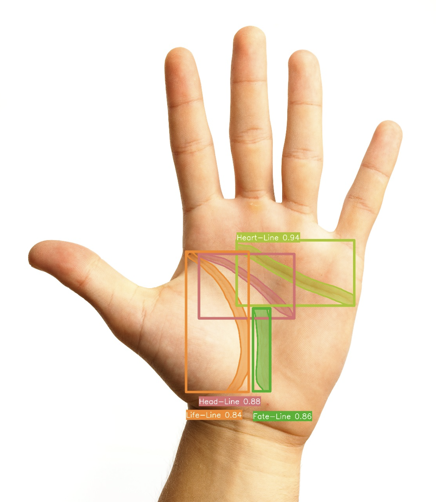

# Palm Reader – Palm Line Detection using Computer Vision

A computer vision project that detects and classifies major palm lines from hand images using object detection techniques.

The system identifies key palmistry lines such as the **Heart Line, Head Line, Life Line, and Fate Line**, and visualizes them on the input image with confidence scores.

---

# Demo

### Palm Line Detection Example



Detected palm lines include:

* Heart Line
* Head Line
* Life Line
* Fate Line

Each detected region is displayed with a bounding box and confidence score.

---

# Project Overview

Palmistry traditionally requires manual interpretation of palm lines. This project demonstrates how **computer vision and deep learning** can automatically detect and classify palm lines from images.

The system processes a hand image and predicts bounding boxes corresponding to major palm lines.

This project showcases applications of:

* Object detection
* Image processing
* Visual annotation
* Deep learning for feature detection

---

# Key Features

Automatic palm line detection
Detection of major palmistry lines
Bounding box visualization
Confidence score prediction
Image-based inference pipeline
Computer vision model integration

---

# Detected Palm Lines

The model detects the following lines:

| Line       | Description                            |
| ---------- | -------------------------------------- |
| Heart Line | Associated with emotional aspects      |
| Head Line  | Associated with thinking and intellect |
| Life Line  | Associated with vitality and life path |
| Fate Line  | Associated with career and destiny     |

*(Note: This project demonstrates technical detection, not actual palm reading predictions.)*

---

# System Pipeline

The palm detection system follows this workflow:

```
Input Hand Image
      ↓
Image Preprocessing
      ↓
Object Detection Model
      ↓
Palm Line Localization
      ↓
Bounding Box Visualization
      ↓
Confidence Scoring
      ↓
Annotated Output Image
```

---

# Tech Stack

Python
OpenCV
Deep Learning Object Detection
NumPy
Image Processing

*(Replace with actual model if YOLO / TensorFlow / PyTorch is used)*

Example:

```
PyTorch
YOLOv5
OpenCV
NumPy
```

---

# Project Structure

```
palm-reader/
│
├── model/
│   └── palm_line_detector.pt
│
├── data/
│   ├── training_images
│   └── annotations
│
├── src/
│   ├── detect.py
│   ├── preprocess.py
│   └── visualize.py
│
├── demo/
│   └── palm_demo.png
│
├── requirements.txt
└── README.md
```

---

# Installation

Clone the repository

```bash
git clone https://github.com/MuntahaShams/palm-reader.git
cd palm-reader
```

Install dependencies

```bash
pip install -r requirements.txt
```

---

# Running the Detection

Run inference on an image:

```bash
python detect.py --image input.jpg
```

Example output:

```
Detected Lines:
Heart Line  - confidence 0.94
Head Line   - confidence 0.88
Life Line   - confidence 0.84
Fate Line   - confidence 0.86
```

The annotated image will be saved with detected bounding boxes.

---

# Challenges

Palm line detection is challenging due to:

* varying hand shapes
* lighting variations
* skin tone differences
* overlapping lines
* complex line structures

The model learns to detect patterns that correspond to common palm line regions.

---

# Future Improvements

Improve detection accuracy with larger dataset
Add segmentation instead of bounding boxes
Deploy as mobile application
Add real-time detection using camera input
Integrate palm analysis UI

---

# Author

**Muntaha Shams**
AI Engineer — Computer Vision | LLMs | NLP

GitHub
[https://github.com/MuntahaShams](https://github.com/MuntahaShams)

Portfolio
[https://muntahashams.github.io/portfolio/projects](https://muntahashams.github.io/portfolio/projects)

---
